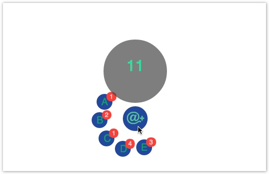

# Homework 10 - Asynchronous JavaScript

> 在Homework 3 - Ring Menu代码的基础上，添加与服务器交互的Ajax代码，环形菜单变身为环形Async求和计算器。

|环形菜单|环形Async求和计算器|
|-|-|
||1. 菜单按钮变为A、B、C、D、E 5个按钮 2. info-bar（大气泡）变为求和结果显示 交互说明 1. 原有的指向@+显示按钮和大气泡的交互不变 2. 点击A~E的按钮将向Server发送随机数请求，并将随机数显示在按钮右上角的圆圈内 3. 点击大气泡，将计算A~E各个按钮的随机数的和，并显示在大气泡内

Server的代码是[server.js](server.js)，向其发送 HTTP GET请求，服务器将随机在1~3秒之间，随机返回一个[1, 10]之间的整数。

## S1：人工交互
完成从环形菜单，向环形Async求和计算器的转变。计算器交互有以下约束：

1. A~E的按钮：
    - a. 在未得到随机数之前，不显示右上角的红色圆圈
    - b. 用户点击某个按钮，将显示其对应红色圆圈，并发送请求到服务器获取随机数
    - c. 在得到结果前
        - i. 红色圆圈内显示`...`，表示正在等待随机数
        - ii. 灭活（disable）其它按钮，变为灰色，用户不能够点击（点击没有响应，也不会发送新的请求到服务器）
    - d. 得到服务器发回的随机数后，
        - i. 显示在当前按钮右上角红色圆圈内
        - ii. 灭活当前按钮，变为灰色，用户不能够点击
        - iii. 激活（enable）其余按钮，呈现为蓝色，用户可以点击，从服务器获取随机数
2. 大气泡
    - a. 在A~E未能全部得到自己的随机数之前
        - i. 大气泡内无任何显示
        - ii. 灭活大气泡，用户不能够点击
    - b. 当A~E按钮全部获得了自己的随机数时，激活大气泡
    - c. 此时，点击大气泡
        - i. 计算A~E随机数的和，显示在大气泡内
        - ii. 灭活大气泡
3. @+按钮
    - a. 任何时候，鼠标离开@+区域，将重置整个计算器，清除所有A~E按钮的随机数和大气泡内的和
    - b. 鼠标再次指向@+，可以开始新一轮的计算操作

## S2：仿真机器人，顺序（一指禅）

在满足S1的各种约束的情况下，设计一段机器人程序，点击@+按钮，将执行这段机器人程序：

1. 模拟自动执行从A~E点击按钮，获取随机数，然后点击大气泡求和的过程
2. 要求完全模拟全过程，包括红圈的出现、随机数的显示、和的显示，以及按钮的激活与灭活
3. 重点：必须严格的模拟按A~E、然后大气泡的顺序点击按钮的过程
    - a. 例如：当机器人按下A之后，将等待A的随机数显示，其余B~E按钮激活
    - b. 此时，机器人将立即按下B
    - c. 此后，与此相似，以此类推……

## S3：仿真机器人，并行（五指金龙）

同S2一样，设计一段机器人程序，点击@+按钮，将模拟同时按下A~E按钮，并在所有随机数到达后，立即按下大气泡的过程。

1. 根据S1的规则，初始时，A~E 5个按钮都是可以按下的
2. 这时，机器人5指齐按，同时向server发出请求
3. 机器人观察到所有数据到达后，再按下大气泡

## S4：仿真机器人，随机（乱点鸳鸯）

同S2一样，设计一段机器人程序，点击@+按钮，将模拟随机单击A~E按钮，并在所有随机数到达后，立即按下大气泡的过程。
1. 点击@+后，机器人先计算一个点击A~E的随机顺序，例如：（B、C、E、A、D），并将此顺序显示在大气泡上方
2. 机器人仿真模拟按此顺序点击按钮求和的情况

## S5：仿真机器人，独立行为（终极秘密） 

类似S4，先计算并显示一个即将操作的顺序，然后机器人进行点击按钮。不同的是，要求A、B、C、D、E和大气泡不能够共享事件处理代码。 

1. 每个小按钮、大气泡独立的写一个处理函数（handler），例如：aHandler、bHandler、cHandler、dHandler、eHandler、bubbleHandler
2. 计算出操作顺序后，机器人必须按顺序依次调用各handler，传递参数和处理异常
    - a. **各handler逻辑**：除了与S4行为相同，取服务器随机数，最后计算之外，还要实现下述行为：
        - i. 在大气泡上方显示一句话（message），分别为：
        - ii. A：这是个天大的秘密
        - iii. B：我不知道
        - iv. C：你不知道
        - v. D：他不知道
        - vi. E：才怪
        - vii. 大气泡：楼主异步调用战斗力感人，目测不超过xxx
            1. xxx为a~e随机数的和
    - b. **分布求和与参数传递**：求和过程分步完成，各handler从参数接收截止到目前的累积和（currentSum），并和自己取回的随机数相加以后，在调用下一个handler时，作为参数传递过去
    - c. **异常处理**：
        - i. 各handler的处理会随机失败，失败的handler不输出message，而是传回{message，currentSum}
            1. message为原定message的否定形式
            2. currentSum即为当前计算出的累计和
        - ii. 调用者必须处理异常，保证整个应用程序正常，执行过程不变。
            1. 调用者根据异常，帮callee显示message
            2. 调用者执行自己的逻辑
    - d. **不允许使用任何全局变量！**