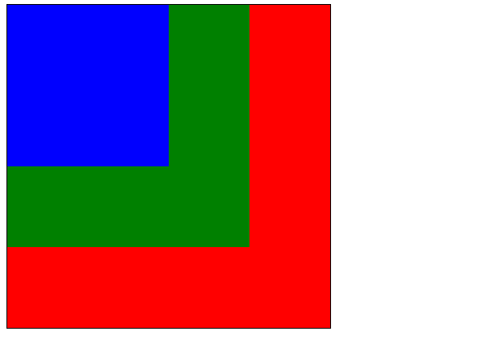
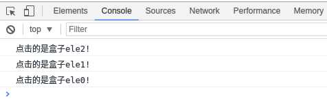
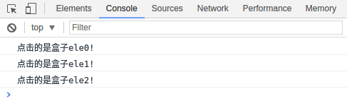

# 记录一些学习前端的小知识

因为自己的前端学习不是非常的系统, 有很多东西都是自己在做东西的时候通过其他途径慢慢学习到的, 害怕自己以后会忘掉所以就做点笔记来记录, 方便以后复习。

学习JavaScript要对一些概念充分掌握，可参考学习<https://johnresig.com/apps/learn/>，里面只有代码，务必充分理解这些代码的含义，很多概念隐藏在这些代码之下。

## 一、垂直居中布局技巧：

让一个`div`在整个页面中居中的技巧：

### 1.

首先让`<body>`的高度和整个页面一样高，然后让`div`的`top`和`left`等于`50%`，注意使用`top`和`left`的前提是元素的`position`设置为非`static`(自动变为块级元素)，再利用`margin`或`transform`进行调整位置。对`margin`的理解不要局限在只是外边距，更像是一种反作用力，如果相邻元素是固定位置的，比如是父级元素的`border`的时候，`margin`元素会使得位置发生变化。

举一个简单的例子：

```html
<body>
    <div id="box"></div>
</body>
```

css部分如下：

```css
* {
    margin: 0;
    padding: 0;
}

html {
    /*重点*/
    height: 100%;
}

body {
    /*重点*/
    height: 100%;
}

#box {
    width: 100px;
    height: 100px;
    background-color: red;

    /*重点*/
    position: absolute;
    top: 50%;
    left: 50%;
    /*transform调整方法*/
    transform: translateX(-50%) translateY(-50%);
    /*margin调整方法*/
    /*
    margin-left: -50px;
    margin-right: -50px;
    */
}
```

`*`是通配符选择器，一般来说都会事先用它来消除不同浏览器的默认设置，当然默认设置还有很多，网上有专门消除所有默认设置的文件，可以去下载。

### 2.

第二个方法和第一个方法类似，不需要`transform`调整位置，只需要将`top`、`bottom`、`left`和`right`置为0，然后利用`margin`的自适应让`div`居中：

```css
#box {
    width: 100px;
    height: 100px;
    background-color: red;

    /*重点*/
    position: absolute;
    top: 0;
    bottom: 0;
    left: 0;
    right: 0;
    margin: auto;
}
```

`html`和`body`部分依旧。

### 3.

第三种方法更简单，需要使用网格布局:

```css
body {
    /*重点*/
    height: 100%;
    /*网格布局*/
    display: grid;
}

#box {
    width: 100px;
    height: 100px;
    background-color: red;

    /*重点*/
    margin: auto;
}
```

## 二、JavaScript -- Event

事件传播通常有三个阶段：事件捕获阶段、事件目标阶段、事件冒泡阶段，先捕获再冒泡，因为捕获阶段很少用，所以常被人们忽略。

### 1\. 事件冒泡

事件冒泡指的是当前目标元素触发时间的发生，事件会向祖先元素传播，进而在祖先元素上触发相同的事件，当子元素都有同一时间处理程序时，事件冒泡可以减少代码的冗余度，通过给`addEventListener()`第三个参数传递`false`表示为执行事件冒泡，但通常默认情况下就是冒泡。`true`表示执行捕获。举个简单例子：

```html
<div class="ele0">
    <div class="ele1">
        <div class="ele2"></div>
    </div>
</div>
```

三重div显示效果为：



`JavaScript`脚本为：

```javascript
window.onload=function() {
    var ele = document.getElementsByTagName('div');

    if (ele[0].addEventListener) {
        ele[0].addEventListener('click', function () {
            console.log('点击的是盒子ele0!');
        });
    }
    else {
        ele[0].attachEvent('onclick', function() {
            console.log('点击的是盒子ele0!');
        })
    }

    if (ele[1].addEventListener) {
        ele[1].addEventListener('click', function () {
            console.log('点击的是盒子ele1!');
        });
    }
    else {
        ele[1].attachEvent('onclick', function() {
            console.log('点击的是盒子ele1!');
        })
    }

    if (ele[2].addEventListener) {
        ele[2].addEventListener('click', function () {
            console.log('点击的是盒子ele2!');
        });
    }
    else {
        ele[2].attachEvent('onclick', function() {
            console.log('点击的是盒子ele2!');
        })
    }
}
```

即当点击哪个`div`就会在控制台中显示，当我们点击`ele2`也就是最里面的盒子时，控制台显示为：



显然可以看到事件从`ele2`传递到`ele1`，再传递到`ele0`，像是气泡一样从事件发生的地方逐层向上到最高级的元素，这就是事件冒泡。

### 2\. 事件捕获

事件捕获过程和冒泡是相反的过程，事件由祖先元素向子元素传播，要说明的是在IE和opera浏览器中不存在这个阶段。继续刚刚那个例子，如果给每个监听器的第三个参数添加`true`，并且点击`ele2`时，控制台显示为：



### 3\. 阻止事件冒泡

有的时候我们可能并不希望事件冒泡的发生，在除了IE以外的浏览器中通过`e.stopPropagation()`方法阻止冒泡（`e`为事件参数）。在jQuery中通过实践回调利用`return false;`

### 4\. `target`

`Event`的属性`target`表示当前触发事件的对象，即使冒泡后也是最初触发的对象。

## 三、`eval`方法

`javascript`中的`eval()`函数的参数是字符串，能够让传入的参数在js的控制台执行并返回执行结果。可以用来制作简单的网页计算器。

## 四、`inline-block`

`inline-block`既具备了行内元素和块级元素的特点，既能够让元素能向行内元素一样横向显示，又能够规定其`width`和`height`，但有一个小缺陷，就是它会产生一点空白，以一个导航栏为例：

html:

```html
   <nav>
       <ul>
           <li>HOME</li>
           <li>MUSIC</li>
           <li>IMAGE</li>
           <li>BLOG</li>
           <li>ABOUT</li>
       </ul>
   </nav>
```

css:

```css
   ul li {
       list-style-type: none;
       display: inline-block;
       width: 80px;
       height: 50px;
       background-color: skyblue;
       border: 1px solid black;
       text-align: center;
       line-height: 50px;
   }
```

显示效果为：


可以看到有很明显的间距，虽然`margin`和`padding`设置为0后依然存在，消除的方法为：将父级元素`ul`添加css`font-size: 0;`，为了让字体能显示`li`中再设置字体：

```css
   ul {
       font-size: 0;
   }

   ul li {
       ...
       font-size: 16px;
   }
```

显示效果为：


## 五、优化css

`css`使用选择器的时候匹配规则是从右到左的，因此为了性能考虑应该尽量减少选择器中要匹配的选项，详细参考[如何提升 CSS 选择器性能](https://www.jianshu.com/p/268c7f3dd7a6)。

## 六、`bind`方法

关于js的`bind`方法实现：

```javascript
// The .bind method from Prototype.js
Function.prototype.bind = function(){
  var fn = this, args = Array.prototype.slice.call(arguments), object = args.shift();
  return function(){
    return fn.apply(object,
      args.concat(Array.prototype.slice.call(arguments)));
  };
};
```

`bind`方法类似与`apply`和`call`方法，都是为了改变`this`的指向，`bind`更灵活的地方在于它返回的不是执行函数后的结果，而是绑定了第一个传入对象的函数，举个简单的例子：

```javascript
function sayHi(age, id) {
    console.log('Hi, I am ' + this.name + '!');
    console.log('I am ' + age + ' years old.');
    console.log('My ID is ' + id + '.');
}

var a = { name: 'Sam' };

var f = sayHi.bind(a, 18, 1000);

f();
/* 调用结果：
Hi, I am Sam!
I am 15 years old.
My ID is 1000.
*/
```

`Array.prototype.slice.call()`能够把所有含有`length`属性的对象转化为数组。关于`args.concat(Array.prototype.slice.call(arguments)));`这一行的说明：`bind`方法有一个比较奇怪的传参方式，它的参数可以分成两次传递，当然，要绑定的对象第一次必须传入，以上面那个例子为例：

```javascript
var f2 = sayHi.bind(a, 18);

f2(1001);

Hi, I am Sam!
I am 18 years old.
My ID is 1001.
```

## 七、JS函数执行顺序

参考知乎问题[JS中函数执行顺序的问题](https://www.zhihu.com/question/23564807)。

### 1\. 代码块

JavaScript中的代码块是指由`<script>`和`</script>`包起来的代码部分。在HTML文件中可以有多个代码块。需要知道：

- 代码块间相互独立，如一个代码块中出错，不会影响另一个代码块的执行。
- 代码块数据共享，即共享变量和函数。

### 2\. 声明式函数和赋值式函数

```javascript
function F() {          // 声明式函数
    ...
}

var F = function () {   // 赋值式函数
    ...
}
```

在JS预编译期，声明式函数会先拿出来，然后再顺序执行js。

### 3\. 预编译期和执行期

预编译期发生在执行期之前，预编译期JS对代码块中所有声明的变量和函数进行处理，处理的函数只是声明式函数，变量只进行声明但不进行赋值。因此即使函数声明放在调用之后也不会出错，因为在时间轴上声明会在调用之前。

```javascript
Fn();   // 正常运行

function Fn() {
    ...
}
```

但需要注意的是这里的声明和调用是发生在同一个代码块里，如果在不同的代码块中时则不一定。比如：

```html
<script>    <!-- 代码块一 -->
    Fn();       // 报错
</script>

<script>    <!-- 代码块二 -->
    function Fn() {
        ...
    }
</script>
```

总结JS的执行顺序如下：

1. 读入第一个代码块。
2. 语法分析，如果错误则报错，并跳到第5步。
3. 对变量和声明式函数做预处理，这个阶段不会报错，前面出错的这里不会解析。
4. 执行代码段，有错则报错。
5. 如果有下一个代码段，则读入，并重复第2步。
6. 结束。

### 4\. 补充说明函数

参考[js执行上线](https://www.cnblogs.com/ssh-007/p/5064699.html)。

函数内部也可以理解为一个代码块，按照如上步骤，只不过它的读入发生在调用时。

每个函数都有自己执行的上下文EC(execution context)，每个上下文中都有他自己的变量对象VO(Variable object)，用于存储执行上下文中的变量、函数声明、函数参数，这解释了js如何找到定义的函数和变量。函数是js中唯一一个能创建出作用域的，其他的`for`、`if`等均不能创建作用域。

VO按照如下顺序填充：

1. 函数参数（若未传入，初始化该参数为`undefined`）
2. 函数声明（若发生命名冲突，会覆盖）
3. 变量声明（初始化为`undefined`，若发生冲突会忽略）

## 八、关于函数名

### 1\. 递归

在别的语言中也接触过递归的概念，简单来说就是函数对自己的调用。JavaScript也可以使用递归，如：

```javascript
function yell(n) {
    return n > 0 ? yell(n-1) + "a" : "hiy";
}

yell(4);    // "hiyaaaa"
```

由此我们可以看到第一点，就是在JavaScript函数体内部使用函数名是正确的，不会报错。

### 2\. 赋值式函数

我们知道JavaScript有另一种定义函数的方式（赋值）：

```javascript
var yell = function han(n) {
    return n > 0 ? han(n-1) + "a" : "hiy";
};

// 只能用yell调用，而不能用han
yell(4);                        // "hiyaaaa"

typeof han === 'undefined';     // true
```

即`han`并没有在函数外被定义，它的作用域局限在函数内。

### 3\. 对象的方法名

一般来说定义对象的方法时，函数体内部也能直接使用方法名：

```javascript
var ninja = {
    yell: function (n) {
        // 注意这里用的是 ninja.yell，不能只是 yell
        return n > 0 ? ninja.yell(n-1) + "a" : "hiy";
    }
};

ninja.yell(4);      // "hiyaaaa"
```

接下来就能看到JavaScript作为动态语言的特点了，如果我们改变ninja的指向使得其不含有yell方法了会怎么样？

```javascript
var ninja = {
  yell: function(n){
    return n > 0 ? ninja.yell(n-1) + "a" : "hiy";
  }
};

var samurai = { yell: ninja.yell };
var ninja = null;

samurai.yell(4);        // error!
```

这是因为当改变ninja的指向的时候，函数定义内部的ninja.yell就也会发生变化，这就是动态语言的一个特点，那有没有办法让方法被绑定呢？有两种方式，都是在定义的时候做一些小改动：

```javascript
// 第一种方式，function 后面加名字，不用匿名函数
// 这个方式不方便在于当改变了方法名字里面的定义不会改变
var ninja = {
    yell: function yell(n){
        // 注意这里是 yell 而不是 ninja.yell 了
        // 这里能用 yell 的原因是 function 后面有了 yell
        return n > 0 ? yell(n-1) + "a" : "hiy";
    }
};

// 第二种方式，如果非要用匿名函数，则使用 arguments 属性 callee 表示当前函数
var ninja = {
    yell: function (n){
        return n > 0 ? arguments.callee(n-1) + "a" : "hiy";
    }
};
```

## 九、一些技巧

### 1\. 获取Max/Min

```javascript
// 获取 array 的最大最小值
function smallest(array) {
    return Math.min.apply(Math, array);
}
function largest(array) {
    return Math.max.apply(Math, array);
}

// 获取 arguments 的最大最小值，同上
function smallest() {
    return Math.min.apply(Math, arguments);
}
function largest(array) {
    return Math.max.apply(Math, arguments);
}
```

我们通常会遇到需要把`arguments`转成`Array`的情况，比如想调用`sort`方法时，应该使用`Array`对象。

```javascript
// 错误示范
function highest() {
    return arguments.sort(function (a, b) {
        return b - a;   // 降序
    });
}
```

这么做会报错，因为`arguments`对象没有`sort`方法，应该把`arguments`转成`Array`，正确做法为：

```javascript
function highest() {
    // 或者可以用 Array.prototype.slice.call
    return Array().slice.call(arguments).sort(function (a, b) {
        return b - a;   // 降序
    });
}
```
