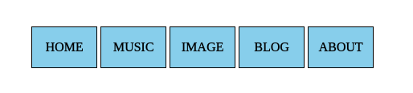
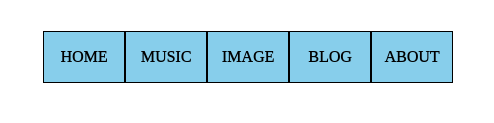

# 记录一些学习前端的小知识

因为自己的前端学习不是非常的系统, 有很多东西都是自己在做东西的时候通过其他途径慢慢学习到的, 害怕自己以后会忘掉所以就做点笔记来记录, 方便以后复习。

## 一、垂直居中布局技巧：

让一个`div`在整个页面中居中的技巧：

### 1.

首先让`<body>`的高度和整个页面一样高，然后让`div`的`top`和`left`等于`50%`，注意使用`top`和`left`的前提是元素的`position`设置为非`static`(自动变为块级元素)，再利用`margin`或`transform`进行调整位置。对`margin`的理解不要局限在只是外边距，更像是一种反作用力，如果相邻元素是固定位置的，比如是父级元素的`border`的时候，`margin`元素会使得位置发生变化。

举一个简单的例子：

```html
<body>
    <div id="box"></div>
</body>
```

css部分如下：

```css
* {
    margin: 0;
    padding: 0;
}

html {
    /*重点*/
    height: 100%;
}

body {
    /*重点*/
    height: 100%;
}

#box {
    width: 100px;
    height: 100px;
    background-color: red;

    /*重点*/
    position: absolute;
    top: 50%;
    left: 50%;
    /*transform调整方法*/
    transform: translateX(-50%) translateY(-50%);
    /*margin调整方法*/
    /*
    margin-left: -50px;
    margin-right: -50px;
    */
}
```

`*`是通配符选择器，一般来说都会事先用它来消除不同浏览器的默认设置，当然默认设置还有很多，网上有专门消除所有默认设置的文件，可以去下载。

### 2.

第二个方法和第一个方法类似，不需要`transform`调整位置，只需要将`top`、`bottom`、`left`和`right`置为0，然后利用`margin`的自适应让`div`居中：

```css
#box {
    width: 100px;
    height: 100px;
    background-color: red;

    /*重点*/
    position: absolute;
    top: 0;
    bottom: 0;
    left: 0;
    right: 0;
    margin: auto;
}
```

`html`和`body`部分依旧。

### 3.

第三种方法更简单，需要使用网格布局:

```css
body {
    /*重点*/
    height: 100%;
    /*网格布局*/
    display: grid;
}

#box {
    width: 100px;
    height: 100px;
    background-color: red;

    /*重点*/
    margin: auto;
}
```

## 二、零碎的知识点：

1. `javascript`中的`eval()`函数的参数是字符串，能够让传入的参数在js的控制台执行并返回执行结果。可以用来制作简单的网页计算器。

2. 如果本地没有`jQuery`库可以在`<head>`引入：

  ```html
   <head>
       <!-- x的部分是版本号 -->
       <script src="//code.jquery.com/jquery-x.x.x.min.js"></script>
       ...
   </head>
  ```

3. `inline-block`既具备了行内元素和块级元素的特点，既能够让元素能向行内元素一样横向显示，又能够规定其`width`和`height`，但有一个小缺陷，就是它会产生一点空白，以一个导航栏为例：

  html:

  ```html
   <nav>
       <ul>
           <li>HOME</li>
           <li>MUSIC</li>
           <li>IMAGE</li>
           <li>BLOG</li>
           <li>ABOUT</li>
       </ul>
   </nav>
  ```

  css:

  ```css
   ul li {
       list-style-type: none;
       display: inline-block;
       width: 80px;
       height: 50px;
       background-color: skyblue;
       border: 1px solid black;
       text-align: center;
       line-height: 50px;
   }
  ```

  显示效果为：

  

  可以看到有很明显的间距，虽然`margin`和`padding`设置为0后依然存在，消除的方法为：将父级元素`ul`添加css`font-size: 0;`，为了让字体能显示`li`中再设置字体：

  ```css
   ul {
       font-size: 0;
   }

   ul li {
       ...
       font-size: 16px;
   }
  ```

  显示效果为：

  
